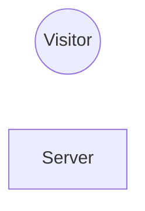

## Requirements

I need a place online to dump my thoughts and link my various projects. It just needs to be content, it doesn't need to be fancy. It also needs to be very cheap to host.

## Decisions

Every personal project is a chance to learn a new tech I wouldn't get to explore at work. I'd prefer 

